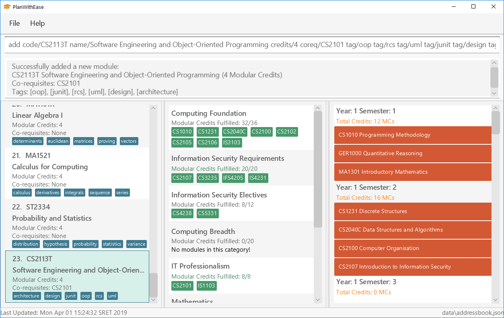

= PlanWithEase
ifdef::env-github,env-browser[:relfileprefix: docs/]

https://travis-ci.org/CS2113-AY1819S2-T09-1/main[image:https://img.shields.io/travis/CS2113-AY1819S2-T09-1/main/master.svg?logo=travis-ci&logoColor=FFDC00&cacheSeconds=0[Travis CI Build Status]]
https://ci.appveyor.com/project/Creastery/main[image:https://img.shields.io/appveyor/ci/Creastery/main/master.svg?logo=appveyor&logoColor=39CCCC&cacheSeconds=0[AppVeyor CI Build Status]]
https://coveralls.io/github/CS2113-AY1819S2-T09-1/main?branch=master[image:https://img.shields.io/coveralls/github/CS2113-AY1819S2-T09-1/main.svg?logo=reverbnation&logoColor=FF851B&cacheSeconds=0[Coveralls Code Coverage Status]]
https://www.codacy.com/app/cs2113-ay1819s2-t09-1/main[image:https://img.shields.io/codacy/grade/fb54572137f043de9b9913f791b4017f.svg?logo=codacy&logoColor=white&cacheSeconds=0[Codacy Code Quality Status]]
https://app.netlify.com/sites/cs2113-ay1819s2-t09-1/deploys[image:https://img.shields.io/badge/dynamic/json.svg?url=https://api.netlify.com/api/v1/sites/cs2113-ay1819s2-t09-1.netlify.com/deploys&query=$%5B0%5D.state&label=deploy&color=blue&logo=netlify&cacheSeconds=0[Netlify Deploy Previews Status]]
link:https://github.com/cs2113-ay1819s2-t09-1/main/blob/master/LICENSE[image:https://img.shields.io/badge/license-MIT-blue.svg?logo=github&logoColor=white[MIT License]]

ifdef::env-github[]

endif::[]

ifndef::env-github[]
image::images/Ui.png[width="600"]
endif::[]

* PlanWithEase (PWE) is a degree planner desktop application. It has a GUI but most of the user
interactions happen
using a CLI
(Command Line Interface).
* PWE is designed to help students in National University of Singapore(NUS) Information Security freshmen in creating a
 comprehensive degree plan according to the degree requirements.
* PWE is optimized for those who prefer using a CLI. The commands used to interact with PWE
are designed to be simple and intuitive, so even those who are unfamiliar with CLI can use PWE with ease.

* PWE allows users to:
** plan their module quickly and more conveniently.
** automate checking of module pre-requisites to avoid module conflicts. _(coming soon)_
** provide an informed decision so that the user are able to decide which module to take at which semester.

== Site Map

* <<UserGuide#, User Guide>>
* <<DeveloperGuide#, Developer Guide>>
* <<AboutUs#, About Us>>
* <<ContactUs#, Contact Us>>

== Acknowledgements
* Original source: https://github.com/se-edu/addressbook-level4[AddressBook
Level 4 project] created by https://github.com/se-edu/[SE-EDU initiative]
* Some parts of this sample application were inspired by the excellent http://code.makery.ch/library/javafx-8-tutorial/[Java FX tutorial] by
_Marco Jakob_.
* Libraries used: https://github.com/TestFX/TestFX[TestFX], https://github.com/FasterXML/jackson[Jackson], https://github.com/junit-team/junit5[JUnit5]

== Licence : link:https://github.com/cs2113-ay1819s2-t09-1/main/blob/master/LICENSE[MIT]
